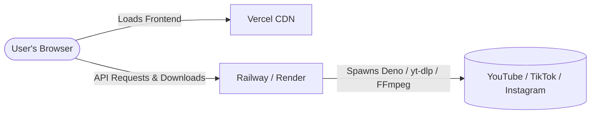

# 🚀 SnapLoad — Cloud Deployment Guide (Vercel & Railway/Render)

To deploy SnapLoad in production, we decouple the application into two parts:
1. **Frontend (React)**: Hosted on **Vercel** for optimal speed, auto-scaling, and global CDN delivery.
2. **Backend (Express API)**: Hosted on **Railway** or **Render** because downloading and merging videos requires system-level binaries (**FFmpeg**, **Python3**, **Deno**) and does not fit inside Vercel's Serverless Function execution limits.

---

## 🎨 Architecture Overview



---

## 📦 Part 1: Deploy the Backend (Railway or Render)

Choose one of the two cloud platforms below to host your Express backend.

### Option A: Railway (Recommended - Easiest Docker setup)
1. Sign up/log in to [Railway.app](https://railway.app).
2. Click **New Project** > **Deploy from GitHub repo**.
3. Select your repository.
4. Railway will automatically detect the `Dockerfile` at the root.
5. Go to your new service settings, click **Variables**, and add:
   * `PORT` = `3001`
   * `NODE_ENV` = `production`
   * `ALLOWED_ORIGINS` = `https://your-app-name.vercel.app` *(Replace with your Vercel frontend URL once deployed)*
6. In **Settings** > **Networking**, click **Generate Domain** to get your backend URL (e.g., `https://snapload-production.up.railway.app`). Keep note of this!

---

### Option B: Render
1. Sign up/log in to [Render.com](https://render.com).
2. Click **New +** > **Web Service**.
3. Connect your GitHub repository.
4. Set the following details:
   * **Language**: `Docker`
   * **Region**: Choose the closest region to your target audience.
5. Scroll down to **Advanced** > **Environment Variables** and add:
   * `NODE_ENV` = `production`
   * `ALLOWED_ORIGINS` = `https://your-app-name.vercel.app` *(Replace with your Vercel frontend URL once deployed)*
6. Click **Deploy Web Service**.
7. Copy the service URL (e.g., `https://snapload-api.onrender.com`).

---

## ⚡ Part 2: Deploy the Frontend (Vercel)

### Step 1: Initialize the Vercel Project
You can deploy using either the Vercel Dashboard (GitHub integration) or the Vercel CLI.

#### Method 1: Using the Vercel Dashboard (Recommended)
1. Go to [Vercel](https://vercel.com) and sign in.
2. Click **Add New** > **Project**.
3. Import your GitHub repository.
4. Configure the Project:
   * **Framework Preset**: `Vite`
   * **Root Directory**: `client` *(Make sure to select the `client` folder!)*
   * **Build and Output Settings**:
     * **Build Command**: `npm run build`
     * **Output Directory**: `dist`
   * **Environment Variables**:
     * Add `VITE_API_URL` = `https://your-backend-url.railway.app` *(Your Railway or Render URL from Part 1)*
5. Click **Deploy**.

#### Method 2: Using the Vercel CLI
If you want to deploy straight from your local terminal:
1. Install and log in to the Vercel CLI:
   ```bash
   npm install -g vercel
   vercel login
   ```
2. Navigate into the client directory:
   ```bash
   cd client
   ```
3. Run the setup command:
   ```bash
   vercel
   ```
4. Follow the prompts:
   * Set up and deploy: `Yes`
   * Select scope/project name: *Choose defaults*
   * Link to existing project: `No`
   * In which directory is your code located? `./`
   * Want to modify settings? `Yes`
     * Add Environment Variable: `VITE_API_URL` = `https://your-backend-url.railway.app`
5. Deploy to production:
   ```bash
   vercel --prod
   ```

---

## 🔗 Part 3: Connect Frontend and Backend

To make sure your deployment works securely, double-check that the frontend and backend can talk to each other:

1. **Frontend Config**: Ensure `VITE_API_URL` in your Vercel dashboard environment variables points to your backend URL (no trailing slash, e.g. `https://snapload-api.onrender.com`).
2. **Backend CORS Config**: Ensure `ALLOWED_ORIGINS` in your Railway/Render settings is set to your production Vercel URL (e.g., `https://snapload.vercel.app`). This prevents unauthorized sites from using your downloader API.

Now, navigate to your Vercel URL. You're all set! 🚀
